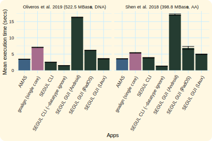
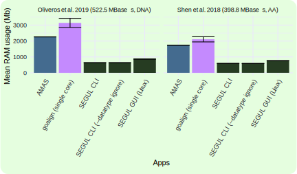

For general users, SEGUL is available in two versions: **Command Line Interface** (CLI) and **Graphical User Interface** (GUI). Both versions have the same core functionality, but they are designed to cater to different use cases and user preferences. The CLI version is suitable for users who prefer automation, fast and memory-efficient execution, dealing with complex directory structures, and/or non-standard file extensions. On the other hand, the GUI version is suitable for users who prefer interactive and user-friendly features. However, having both versions installed is beneficial for users who want to take advantage of the strengths of both versions. Importantly, they each have their own contained environment and do not interfere with each other.

## Platform Support

The GUI version is available for all major desktop and mobile platforms. The CLI version is available for all major desktop platforms and Windows Subsystem for Linux (WSL). Here is a summary of the platform support for both versions:

### Desktop

| Platform                          | GUI | CLI |
| --------------------------------- | --- | --- |
| Linux*                            | ✅   | ✅   |
| MacOS                             | ✅   | ✅   |
| Windows*                          | ✅   | ✅   |
| Windows Subsystem for Linux (WSL) | ❌   | ✅   |

:::note
 The GUI version on **Linux** required GLIBC 2.34+. The CLI works in any Linux distribution. We provide fully static binary for older Linux and dynamically linked binary to GLIBC for newer distributions. See [GUI](./installation/install_gui) and [CLI](./installation/install_binary) installation instruction for more details.

 You can also compile the CLI version from the source code for any platform that supports Rust. See [installation from source code](./installation/install_source) for more details.
:::

### Mobile

| Platform | GUI | CLI |
| -------- | --- | --- |
| iOS      | ✅   | ❌   |
| iPadOS   | ✅   | ❌   |
| Android  | ✅   | ❌   |

:::note
The CLI version works on Android using [Termux](https://termux.dev/). However, we recommend using the GUI version for better access to file system.
:::

## Features comparison

All the main features are supported in both CLI and GUI. However, there are some differences between the two versions. Here is a summary of the differences:

| Feature                                              | CLI | GUI |
| ---------------------------------------------------- | --- | --- |
| Text and table viewer                                | ❌   | ✅   |
| Mobile OS support                                    | ❌   | ✅   |
| `--dry-run` option for some commands                 | ✅   | ❌   |
| Filter out alignment with multiple percentage values | ✅   | ❌   |
| Handling complex directory structure                 | ✅   | ❌   |
| Non-standard file extensions                         | ✅   | ❌   |

## Task Group

The GUI and CLI version of SEGUL have the same task group. The task group is equal to command, whereas the task is equal to subcommand in the CLI version. The name of the task group for CLI version is the same as the GUI version, except for **contig summary statistics** and **partition conversion**. The contig summary statistics is available in the contig subcommand. The partition conversion is available in the partition subcommand.

Learn more about [CLI](./cli-usage/command_options) and [GUI](./gui-usage/general) options.

## Performance and Memory Efficiency

Generally, the CLI version outperforms the GUI version in terms of speed and memory efficiency. The CLI version is exclusively developed in [Rust](https://www.rust-lang.org/), a high-performance programming language. On the other hand, while the core functionality of the GUI version utilizes the same code as the CLI version, the GUI code is written in [Dart](https://dart.dev/). Despite this difference, the GUI version maintains similar speed and memory efficiency for the majority of use cases on identical hardware (see below).

Below is a performance comparison for **alignment concatenation**  across different platforms. In this comparison, SEGUL CLI and GUI on Linux ran on identical hardware. We also include [AMAS](https://github.com/marekborowiec/AMAS) and [goalign](https://github.com/evolbioinfo/goalign) to provide additional context about the performance of SEGUL. For more details about the benchmark, check out [SEGUL-Bench](https://github.com/hhandika/segul-bench).

:::info
For the GUI version on mobile devices, accessing the input file requires caching the file in the app’s designated temporary directory. This process might be more time-consuming compared to running the CLI or GUI on a desktop operating system, and handling large number files may not be feasible. In our test on iOS, we could input up to 1,500 UCE loci on an iPhone 14. On Android, we could input over 4,000 of the UCE loci on a Xiaomi Redmi Note 12 by inputting the file in batches, with a maximum of 1,500 loci per batch. We are working on supporting compressed file input to improve the performance of the GUI version on mobile devices.
:::

### Execution time comparison

### RAM usage comparison

:::note
The RAM usage comparison is only available for the desktop versions of SEGUL.
:::
