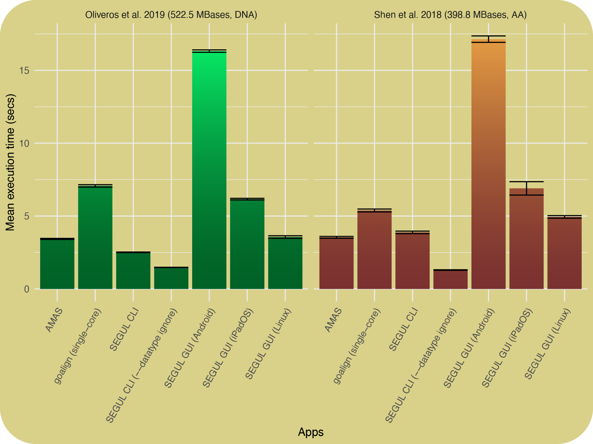
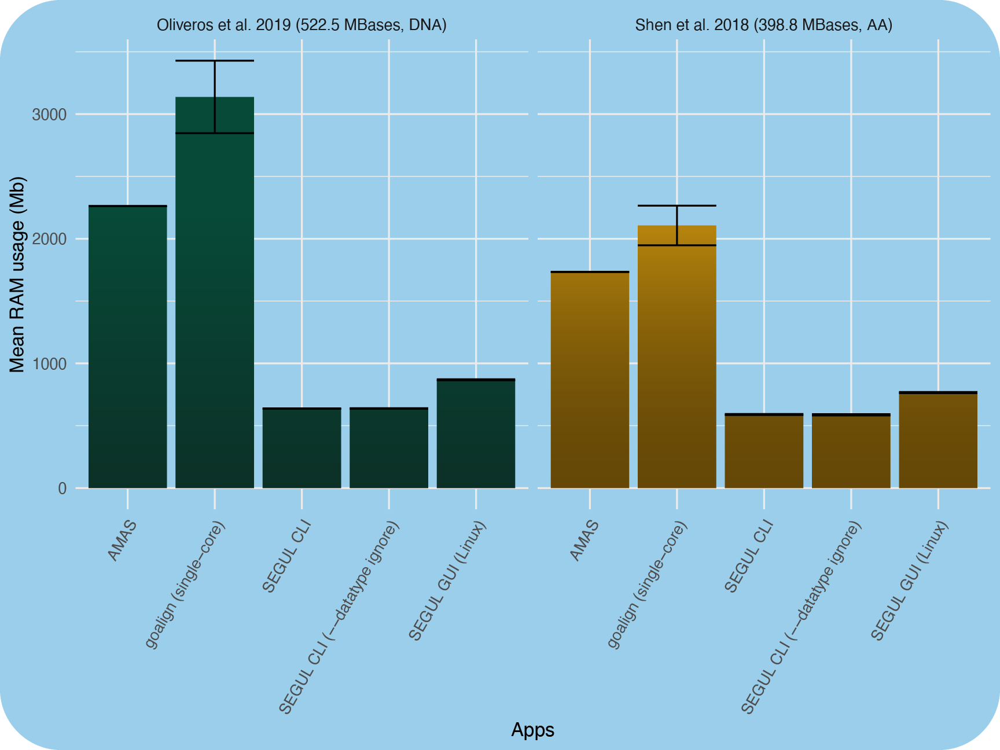

# CLI vs GUI

## Overview

SEGUL is available in two versions: Command Line Interface (CLI) and Graphical User Interface (GUI). Both versions have the same core functionality, but they are designed to cater to different use cases and user preferences. The CLI version is suitable for users who prefer automation, fast and memory-efficient execution, dealing with complex directory structure, and/or non-standard file extension. The GUI version is suitable for users who prefer interactive and user-friendly features. However, having both versions installed is beneficial for users who want to take advantage of the strengths of both versions. They each have their own contained environment and do not interfere with each other.

## Platform Support

The GUI version is available for all major desktop and mobile platforms. The CLI version is available for all major desktop platforms and Windows Subsystem for Linux (WSL). Here is a summary of the platform support for both versions:

### Desktop

| Platform                          | GUI | CLI |
| --------------------------------- | --- | --- |
| Linux*                            | ✅   | ✅   |
| MacOS                             | ✅   | ✅   |
| Windows*                          | ✅   | ✅   |
| Windows Subsystem for Linux (WSL) | ❌   | ✅   |

:::note
 The GUI version on **Linux** required GLIBC 2.34+. The CLI works in any Linux distribution. We provide fully static binary for older Linux and dynamically linked binary to GLIBC for newer distributions. See [GUI](./installation/install_gui) and [CLI](./installation/install_binary) installation instruction for more details.

 The GUI version on **Windows** is available for Windows 10 and later. The CLI version is available for Windows 7 and later.

 You can also compile the CLI version from the source code for any platform that supports Rust. See [installation from source code](./installation/install_source) for more details.
:::

### Mobile

| Platform | GUI | CLI |
| -------- | --- | --- |
| iOS      | ✅   | ❌   |
| iPadOS   | ✅   | ❌   |
| Android  | ✅   | ❌   |

:::note
The CLI version works on Android using [Termux](https://termux.dev/). However, we recommend using the GUI version for better access to file system.
:::

## Performance

The CLI version is faster and more memory-efficient than the GUI version. It is purely written in a high-performance programming language, Rust. For the GUI version, we use Flutter and Dart for the front-end and some light-weight backend code. However, the GUI version is still fast and memory-efficient for most use cases. For GUI version on mobile devices, the input file access would require caching the file in the designated app temporary directory. This process might take longer than running CLI or GUI on desktop operating system and may not be possible for large files.

Below is a performance comparison for concatenating alignments across different platforms. We include [AMAS](https://github.com/marekborowiec/AMAS) and [goalign](https://github.com/evolbioinfo/goalign) to provide more context about the performance of SEGUL.

### Execution time comparison

### RAM usage comparison

## Features comparison

All the main features are supported in both CLI and GUI. However, there are some differences between the two versions. Here is a summary of the differences:

| Feature                                              | CLI | GUI |
| ---------------------------------------------------- | --- | --- |
| Text and table viewer                                | ❌   | ✅   |
| Mobile OS support                                    | ❌   | ✅   |
| `--dry-run` option for some commands                 | ✅   | ❌   |
| Filter out alignment with multiple percentage values | ✅   | ❌   |
| Handling complex directory structure                 | ✅   | ❌   |
| Non-standard file extensions                         | ✅   | ❌   |

## Task Group

The GUI and CLI version of `segul` have the same task group. The task group is equal to command, whereas the task is equal to subcommand in the CLI version. The name of the task group for CLI version is the same as the GUI version, except for contig summary statistics and partition conversion. The contig summary statistics is available in the contig subcommand. The partition conversion is available in the partition subcommand.

Learn more about [CLI](./cli-usage/command_options) and [GUI](./gui-usage/general) options.
